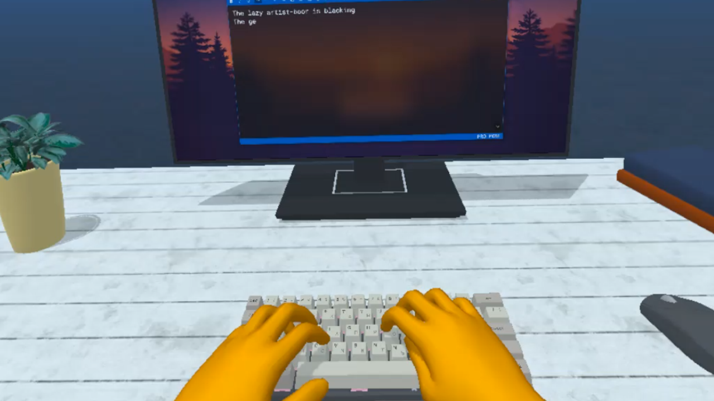
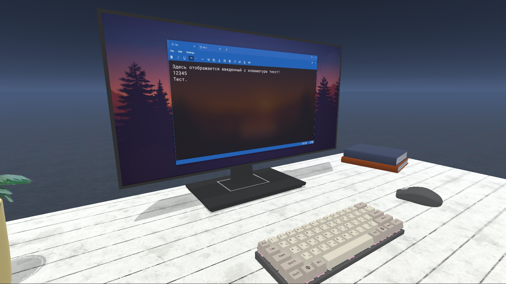
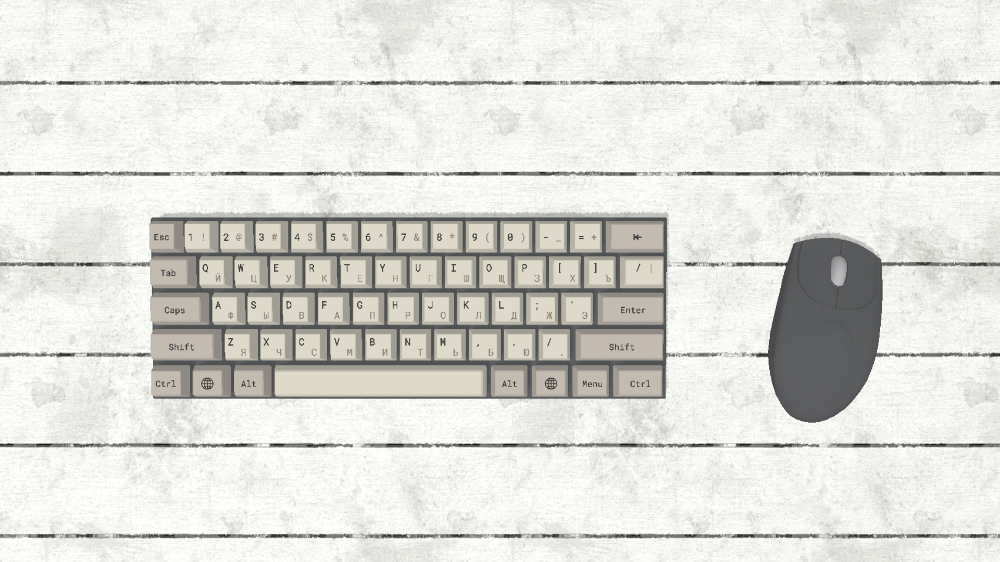

# Title
Клавиатура с отслеживанием рук в VR

---

# Description

```		
    Проект с механической клавиатурой в формате виртуальной реальности для шлемов Oculus Quest и Oculus Quest 2. 
    Нажатия на клавиши осуществляются при помощи трекинга рук с камер шлема, никаких контроллеров!
    Текст, вводимый с клавиатуры, выводится на экран монитора. Клавиатура позволяет печатать на русском и английском языках.
```
---

# Images
* 
* 
* 
---

# Videos

---

# Tags
* Frontend
* Backend
* Mobile
* AR
---
# Tech
* Unity
* C#
---
# Developers
* Смирнов Я.А.
---
# Site
---
# SourceCode
| name                                          | link                                          |
| --------------------------------------------- | -----------------------------------------     |
| Проект | https://github.com/RTUITLab/Oculus-HandTracking-Keyboard   |

---